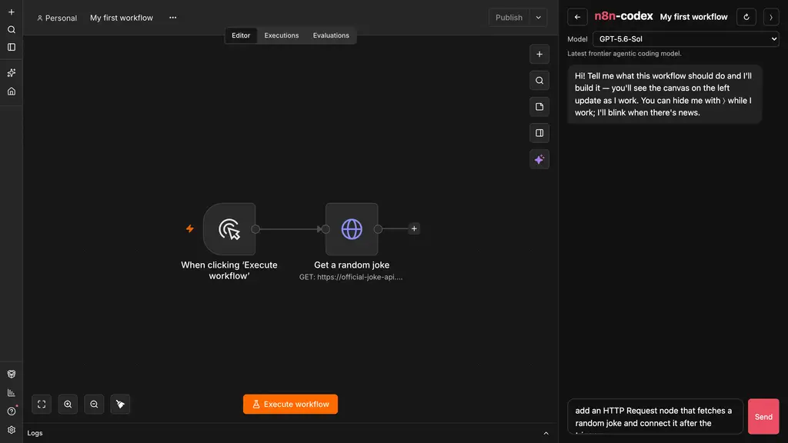
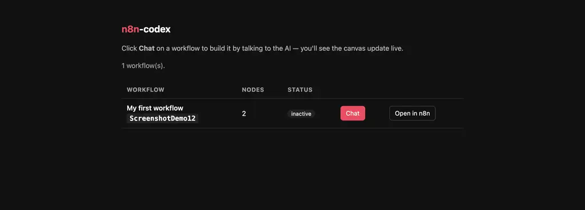

# n8n-codex

Build [n8n](https://n8n.io) workflows by chatting with an AI — and watch the canvas
update live while you talk.



## What you need (every operating system)

| Tool | Why | Check it works |
|---|---|---|
| [Git](https://git-scm.com/downloads) | downloads this repo | `git --version` |
| [Docker Desktop](https://www.docker.com/products/docker-desktop/) — on Linux, [Docker Engine](https://docs.docker.com/engine/install/) | runs n8n | `docker compose version` |
| [Node.js](https://nodejs.org) **18 or newer** (pick the LTS installer) | runs this tool and the AI | `node --version` |
| A [ChatGPT](https://chatgpt.com) account | signs the AI in | — |

Each "check" command should print a version number, not an error. Two rules
that prevent most install problems:

- **New installs need a new terminal.** If a command is "not found" right after
  you installed it, close the terminal and open a fresh one — installers only
  update the PATH of *new* windows.
- **Docker Desktop must be running.** Installing it is not enough: start the
  app and wait until it says "Engine running" (whale icon steady) before typing
  any `docker` command.

## One-time setup (~10 min)

Open the section for your operating system and follow it top to bottom.

<details>
<summary><b>macOS</b> — Apple Silicon or Intel</summary>

1. Install **Docker Desktop for Mac** — the download page offers two builds.
   Check yours under  → *About This Mac*: "Apple M1/M2/M3/M4" → **Apple
   Silicon**; "Intel" → **Intel chip**. Open Docker Desktop once and wait for
   "Engine running".
2. Install **Node.js LTS** from [nodejs.org](https://nodejs.org) (the `.pkg`
   installer). Git is already on macOS (the first `git` run may install the
   command-line tools — accept it).
3. Open **Terminal** (⌘-Space, type "Terminal") and paste one line at a time:

```sh
git clone https://github.com/JoanClaverol/n8n-codex.git && cd n8n-codex
docker compose up -d              # install & start n8n
npm install -g @openai/codex      # the AI assistant
codex login                       # sign in with your ChatGPT account
npm install -g .                  # this tool
```

If an `npm install -g` line fails with `EACCES` / "permission denied", run the
same line with `sudo ` in front (it will ask for your Mac password).

</details>

<details>
<summary><b>Windows</b> — PowerShell (the standard way)</summary>

1. Install **[Git for Windows](https://git-scm.com/download/win)** (default
   options are fine), **Docker Desktop for Windows** (it sets up WSL 2 for
   you — say yes and reboot if asked), and **Node.js LTS** from
   [nodejs.org](https://nodejs.org) (the `.msi` installer).
2. Start Docker Desktop and wait for "Engine running".
3. Open **PowerShell** (Start menu, type "PowerShell") and paste one line at a
   time — on Windows each line must be run separately:

```powershell
git clone https://github.com/JoanClaverol/n8n-codex.git
cd n8n-codex
docker compose up -d
npm install -g @openai/codex
codex login
npm install -g .
```

Windows quirks, in the order you may hit them:

- *"'git' is not recognized"* (or npm/node/codex) right after installing →
  close PowerShell and open a new one.
- *"running scripts is disabled on this system"* → run
  `Set-ExecutionPolicy -ExecutionPolicy RemoteSigned -Scope CurrentUser`,
  answer `Y`, and retry the failed command. One time only.
- Prefer **Git Bash**? The same commands work there unchanged.

</details>

<details>
<summary><b>Windows</b> — inside WSL 2 (if you prefer a Linux shell)</summary>

1. Install **Docker Desktop for Windows**, then enable it for your distro:
   Settings → *Resources* → *WSL integration* → toggle your distro on.
2. In your WSL terminal, install Node 18+ — Ubuntu's default `apt` Node is too
   old, so use [nvm](https://github.com/nvm-sh/nvm):

```sh
curl -o- https://raw.githubusercontent.com/nvm-sh/nvm/v0.40.7/install.sh | bash
exec bash                         # reload the shell so nvm is available
nvm install --lts
```

3. Then the same steps as everywhere:

```sh
git clone https://github.com/JoanClaverol/n8n-codex.git && cd n8n-codex
docker compose up -d
npm install -g @openai/codex
codex login                       # if no browser opens, copy the printed URL into your Windows browser
npm install -g .
```

WSL shares ports with Windows, so the dashboard still opens at
http://localhost:5680 in your normal Windows browser.

</details>

<details>
<summary><b>Linux</b></summary>

1. Install **Docker Engine + the compose plugin** for your distro:
   https://docs.docker.com/engine/install/ (no Docker Desktop needed). Then
   either add yourself to the docker group — `sudo usermod -aG docker $USER`,
   log out and back in — or prefix every `docker` command with `sudo`.
2. Install Node 18+. Distro packages are often too old — check with
   `node --version`; if in doubt use [nvm](https://github.com/nvm-sh/nvm):

```sh
curl -o- https://raw.githubusercontent.com/nvm-sh/nvm/v0.40.7/install.sh | bash
exec bash
nvm install --lts
```

3. Then:

```sh
git clone https://github.com/JoanClaverol/n8n-codex.git && cd n8n-codex
docker compose up -d
npm install -g @openai/codex
codex login                       # if no browser opens, copy the printed URL into one
npm install -g .
```

If `npm install -g` fails with `EACCES`, you installed Node system-wide: rerun
with `sudo`, or switch to nvm (above), which never needs sudo.

</details>

**First time only:** open http://localhost:5678 and create the n8n owner account
(email, name, password with 8+ characters, a number, and a capital letter).

Already installed n8n by hand as a Docker container? `docker compose up -d`
adopts your existing `n8n_data` volume — nothing is lost. Timezone or version
overrides go in `.env` (copy `.env.example`).

## Every day after that

Make sure Docker Desktop is running (macOS/Windows — on Linux the daemon starts
itself), then:

```sh
n8n-codex
```

That's it. It checks everything (and starts n8n for you if it's stopped), then opens
http://localhost:5680 — a list of your workflows:



Click **Chat** on a workflow and just say what you want:

> add an HTTP Request node that fetches a random joke from
> https://official-joke-api.appspot.com/random_joke and connect it after the trigger

The n8n canvas sits right next to the chat and refreshes itself every time the AI
saves. You can say things like "actually, undo that" or "explain what this workflow
does" — the conversation remembers context.
The model picker in each workflow chat is loaded from your installed Codex CLI, so it
only shows models currently available to Codex. Your choice is remembered for that
workflow in the browser and can be changed between messages.

Keep the terminal window open while you work; Ctrl-C stops the tool.

## Updating

Got told there's a new version? Updating takes a minute and never touches your
workflows or backups (workflows live in Docker's `n8n_data` volume, backups in
`~/.n8n-codex/backups/` — neither is affected).

1. If `n8n-codex` is running in a terminal, stop it with **Ctrl-C**.
2. Go to the folder you cloned during setup:

   ```sh
   cd path/to/n8n-codex        # e.g. cd ~/n8n-codex
   ```

3. Download the new version and reinstall the command from it — on Windows
   PowerShell run the lines one at a time:

   ```sh
   git pull --ff-only
   npm install -g .
   ```

4. Start it again: `n8n-codex`. Done.

Both commands are safe to run as often as you like — if there's nothing new,
they simply do nothing.

If a command complains:

| Message | Fix |
|---|---|
| `fatal: not a git repository` | You're not in the right folder — `cd` into the folder where you ran `git clone` during setup |
| `git pull` refuses because of local changes | You edited files inside the folder. Keep your edits out of the way with `git stash`, run `git pull --ff-only` again, then `git stash pop` |
| `EACCES` / permission denied | Rerun as `sudo npm install -g .` (macOS/Linux) |

The Codex CLI and n8n itself are updated separately, whenever you want:

```sh
npm install -g @openai/codex@latest   # newest Codex CLI
docker compose pull                    # newest n8n image (run in this folder)
docker compose up -d                   # restart n8n on it, keeping all data
```

Run `n8n-codex` afterward — its setup check verifies the Codex MCP registration
automatically and repairs it when needed.

## How it works (for the curious)

n8n stores workflows in a database, not files. `n8n-codex` exposes them to the
[Codex CLI](https://github.com/openai/codex) two ways:

- **MCP tools** (`list_workflows`, `get_workflow`, `update_workflow`) — registered
  automatically; any codex conversation can edit your workflows, including the
  dashboard chat, which drives `codex exec` behind the scenes. The official
  [n8n docs MCP server](https://docs.n8n.io/connect/connect-to-n8n-docs-mcp-server)
  is registered too (when your codex version supports it), so the AI can look up
  real node documentation instead of guessing.
- **A file bridge** — `n8n-codex <workflow-id>` pulls a workflow to
  `./n8n-workflows/<name>-<id>/workflow.json`, opens codex there, and auto-deploys
  every save. Useful when you want to see or hand-edit the JSON.

The dashboard also proxies n8n through its own port so the canvas can live in an
iframe beside the chat and reload after each save.

### Other ways to edit (optional)

- **Plain codex in a terminal** — codex has the n8n tools everywhere, so any codex
  conversation can say "add a Set node to my workflow <id>".
- **File-based session** — `n8n-codex <workflow-id>` (the id is in the n8n URL) pulls
  the workflow to `./n8n-workflows/<name>-<id>/workflow.json`, opens codex there, and
  auto-deploys every save. Good for inspecting or hand-editing the JSON.

### All commands

```sh
n8n-codex list          # all workflows with ids
n8n-codex pull <id>     # just download workflow.json
n8n-codex push <id>     # deploy your local workflow.json
n8n-codex watch <id>    # auto-deploy on save, use your own editor instead of codex
n8n-codex --help        # all options (custom container name, ports, folders)
n8n-codex setup         # register the n8n MCP server with codex (run once)
n8n-codex mcp           # the MCP server itself (codex launches this; not for humans)
```

## Safety

- **The canvas locks while the AI works.** During a chat turn the embedded editor is
  covered by a lock screen, and any save you attempt to that workflow is rejected
  until the AI finishes — no more two-writers accidents.
- **Every AI change is backed up first.** Before each save, the previous state is
  snapshotted to `~/.n8n-codex/backups/<workflow-id>/` (the newest 30 are kept).
- **Undo from the terminal:** `n8n-codex restore <id>` puts back the state before the
  last saved change; run it again to go further back.
- You can hide the chat with the ⟩ button — the AI keeps working, the canvas keeps
  updating, and the 💬 rail blinks when there's a new reply.
- **Start over with ↻.** The refresh button wipes the conversation (the AI forgets
  everything, even mid-reply) and re-homes the chat onto whatever saved workflow the
  canvas is currently showing — handy after navigating the embedded editor somewhere
  else. If the canvas isn't on a saved workflow, the chat stays on its current one.
- Invalid workflow JSON is never deployed — it's rejected with an error instead.
- If a workflow is **active**, toggle it off/on in the n8n UI after editing so its
  triggers reload.
- Credentials are never stored in workflow JSON (only credential *references*), so
  the files are safe to share or commit.

### Tests (for maintainers)

`npm test` runs the suite with Node's built-in runner (no dependencies). Codex
is faked by a recording shim, so the tests verify exactly what n8n-codex passes
(argv + stdin) without spending quota; Docker-based tests spin up a throwaway
n8n container and never touch your real one. CI runs everything on every
commit (Ubuntu + Windows). `REAL_CODEX=1 npm test` adds one true-integration
smoke test against the real codex CLI (needs `codex login`, costs quota).
Tests are not part of the installed package — students never download them.


## Troubleshooting

| Symptom | Fix |
|---|---|
| `Docker CLI not found` | Install/start Docker Desktop |
| `no n8n container found` | `docker compose up -d` in this folder; or `n8n-codex --container=<your-name>` |
| Chat says codex is not logged in | Run `codex login` once |
| `Port 5680 is already in use` | Dashboard already running — just open http://localhost:5680 |
| `codex not found on PATH` | `npm install -g @openai/codex` (session keeps watching meanwhile) |
| Changes not visible in n8n | Refresh the browser tab |
| `command not found` / `not recognized` right after an install | Close the terminal and open a new one — PATH updates only reach new windows |
| `EACCES` / permission denied during `npm install -g` | Rerun with `sudo` (macOS/Linux), or install Node via [nvm](https://github.com/nvm-sh/nvm) |
| PowerShell: "running scripts is disabled on this system" | `Set-ExecutionPolicy -ExecutionPolicy RemoteSigned -Scope CurrentUser`, answer `Y`, retry |
| `Cannot connect to the Docker daemon` | Start Docker Desktop and wait for "Engine running"; Linux: `sudo systemctl start docker` |
| WSL: `docker: command not found` | Docker Desktop → Settings → Resources → WSL integration → enable your distro |
| `node --version` shows v17 or older | Install the LTS from [nodejs.org](https://nodejs.org) (or `nvm install --lts`), then reopen the terminal |
